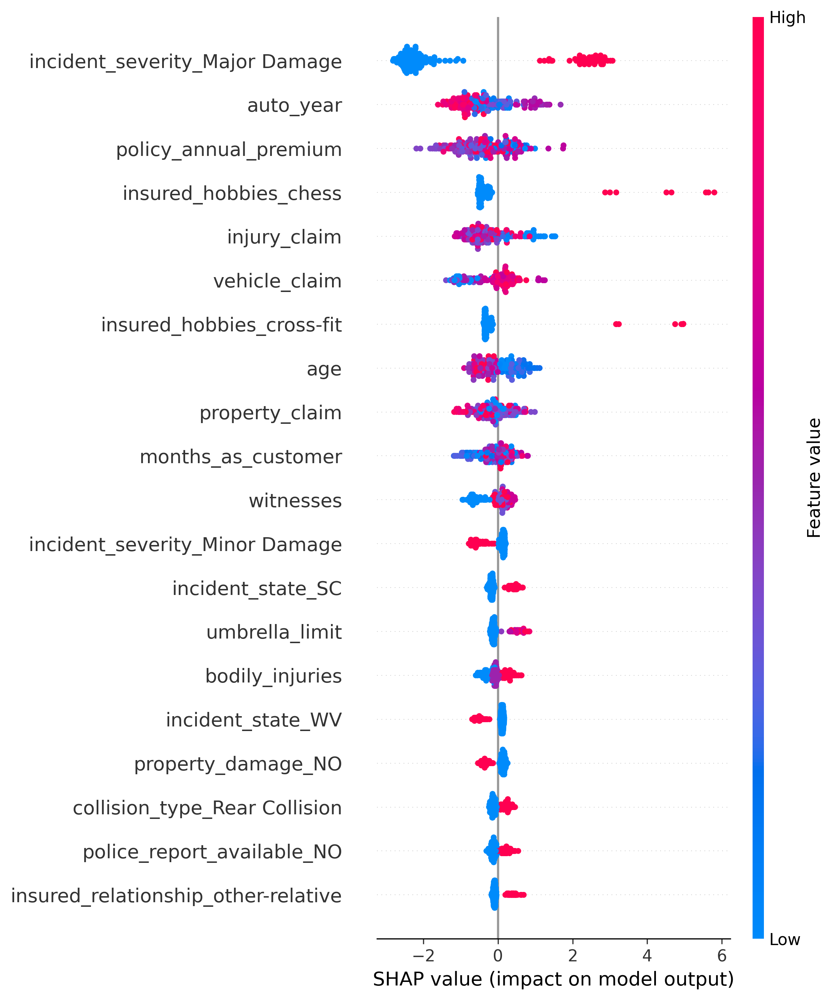
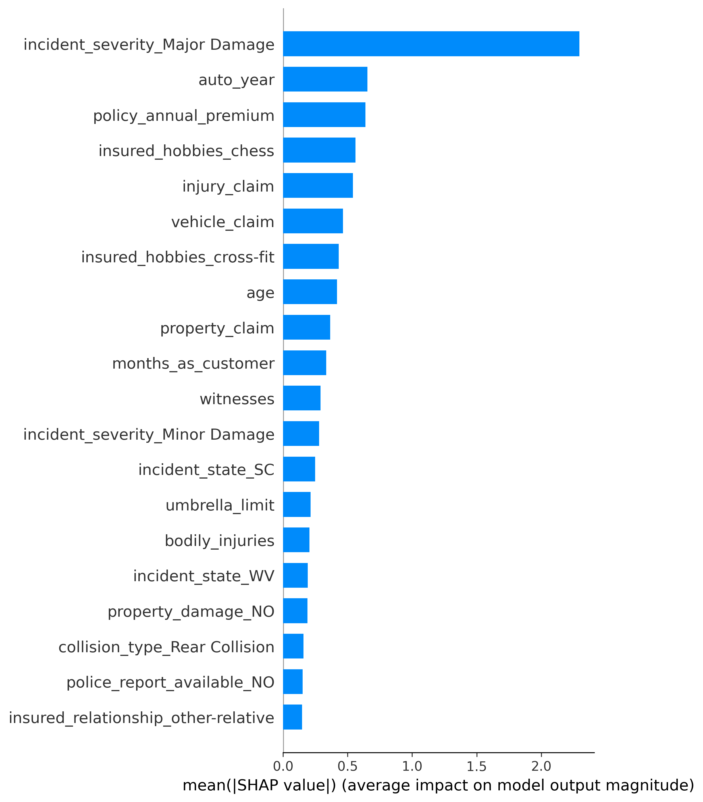

# Fraud Detection using XGBoost, SHAP, and Flask Deployment

This project builds a **fraud detection model** for auto insurance claims using **XGBoost**, a powerful gradient-boosting algorithm.  
It includes **data cleaning, feature engineering, exploratory data analysis (EDA)**, and **model training & evaluation**, followed by **model explainability with SHAP values** and a **Flask API for real-time prediction deployment**.

---

##  Objective

To predict the likelihood of an insurance claim being **fraudulent** based on multiple policy, vehicle, and incident features.  
This project helps understand:
- Which variables are most related to fraudulent claims  
- How to handle **class imbalance** in fraud detection  
- How to interpret model predictions using **SHAP explainability**  
- How to deploy a trained model through a **Flask API** for real-time fraud prediction

---

##  Methods & Workflow

1. **Data Loading & Selection**
   - Reads `insurance_claims.csv`  
   - Selects relevant columns such as customer, policy, vehicle, and claim details  

2. **Data Cleaning**
   - Replaces `"?"` and missing values with clear categories (e.g., `"property_damage_disclosure"`)  
   - Converts target variable `fraud_reported` → `1` for “Yes” and `0` for “No”  

3. **EDA (Exploratory Data Analysis)**
   - Correlation heatmap, class imbalance plots, distribution plots  
   - Summaries by fraud vs. non-fraud  

4. **Feature Engineering**
   - One-Hot Encoding with `pd.get_dummies()` for categorical variables  
   - Removes object columns before modeling  

5. **Model Building**
   - Splits data into **train/test (80/20)** using `train_test_split(stratify=y)`  
   - Trains an **XGBoost Classifier** with parameters:
     ```
     learning_rate=0.05, n_estimators=2000, max_depth=5,
     subsample=0.8, colsample_bytree=0.8, eval_metric='logloss'
     ```
   - Evaluates using:
     - **Confusion matrix**
     - **Classification report**
     - **ROC AUC Score**
     - **ROC Curve Plot**

6. **Explainability (SHAP)**
   - (Next planned step): use SHAP to visualize feature contributions for each prediction.

---

## Evaluation Metrics

| Metric | Description |
|--------|--------------|
| Accuracy | Overall correct classifications |
| Precision | Correct fraud predictions among all predicted frauds |
| Recall | Ability to detect actual fraud cases |
| F1-Score | Balance between precision & recall |
| ROC-AUC | Overall separability between fraud/non-fraud classes |

---
### Confusion Matrix Interpretation
| Actual \ Predicted | Non-Fraud | Fraud |
|--------------------|------------|-------|
| **Non-Fraud** | 138 ✅ | 13 ❌ |
| **Fraud** | 23 ❌ | 26 ✅ |

- **Accuracy:** 0.82 **ROC-AUC:** 0.79  
- The model correctly detects most non-fraud cases and identifies about 53 % of fraud cases.

##  Next Steps
 
- Apply hyperparameter tuning (`RandomizedSearchCV` or `Optuna`)  
- Handle class imbalance with `scale_pos_weight` or SMOTE  
- Save model using `joblib.dump()` for deployment  
- Build a simple Flask API to serve real-time fraud predictions

---
##  Model Explainability (SHAP)
To ensure transparency and interpretability, SHAP (SHapley Additive exPlanations) was used to understand how each variable contributes to the fraud prediction made by the XGBoost model. 
Example plots:



##  Requirements

Install required packages:
```bash
pip install pandas numpy seaborn matplotlib scikit-learn xgboost shap
---

##  Contact

**LinkedIn:** [https://www.linkedin.com/in/nasrin-jamali](https://www.linkedin.com/in/nasrin-jamali)  
**Email:** [jamali.snasrin@gmail.com](mailto:jamali.snasrin@gmail.com)
